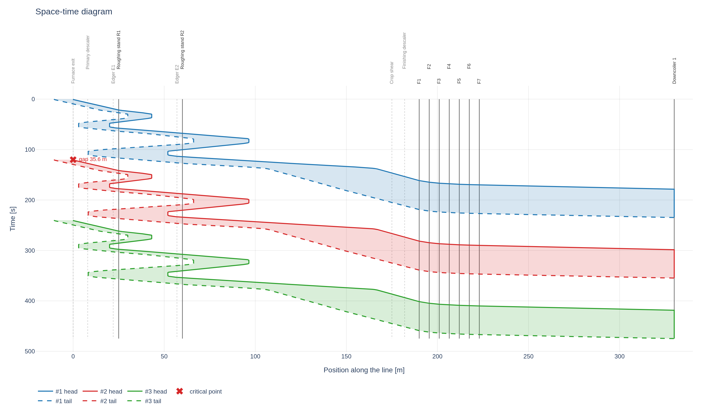
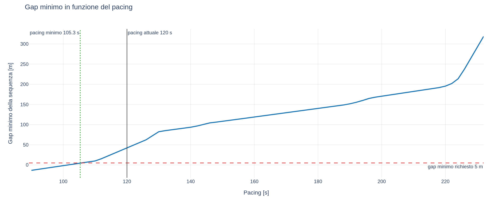

# hsmpace

Diagramma spazio-tempo e analisi del pacing per un **Hot Strip Mill**.

Il tool disegna la posizione di testa e coda dei laminandi lungo la linea, verifica che fra la coda di
un pezzo e la testa di quello successivo resti sempre un gap sufficiente, e determina la cadenza minima
con cui i pezzi possono entrare nel processo.



## Cosa fa

* **Diagramma spazio-tempo**: posizione sull'asse orizzontale come il layout d'impianto, tempo
  sull'asse verticale crescente verso il basso. Ogni pezzo e' una banda fra testa e coda, quindi la
  collisione si legge come contatto fra bande invece che come incrocio di quattro linee.
* **Gap fra pezzi**, in metri e in secondi, con il punto critico localizzato per istante, posizione e
  sezione della linea. Vengono confrontate tutte le coppie che coesistono in linea, non solo quelle
  adiacenti: con lo sbozzatore reversibile il vincolo cade spesso fra il pezzo N e N+2.
* **Curva del gap minimo in funzione del pacing**, da cui si legge direttamente la cadenza minima
  ammissibile e il margine con cui si sta lavorando.

  

* **Robustezza Monte Carlo**: probabilita' di violazione quando velocita' di passata, tempi morti e
  istanti di rilascio hanno la dispersione che hanno in impianto.
* **Occupazione delle gabbie** a diagramma di Gantt e registro completo degli eventi.
* **Confronto con il tracking reale**, per validare il modello su dati misurati.

## Come si usa

### Interfaccia web

```bash
pip install -e .
hsmpace app                      # apre http://127.0.0.1:8731
```

La stessa applicazione gira in due modi, e la scelta si puo' rimandare:

* **in locale** sul PC di chi la usa, come processo che serve `127.0.0.1`: niente server, niente rete,
  nessuna porta da aprire verso l'esterno;
* **su un server d'ufficio**, con `hsmpace app --address 0.0.0.0`, e i colleghi che aprono un URL.

Se sul PC non e' installabile Python, il pacchetto si impacchetta in un eseguibile singolo con
PyInstaller e il comportamento resta identico.

### Riga di comando

```bash
hsmpace template input.xlsx                  # template vuoto da compilare
hsmpace template esempio.xlsx --with-example # esempio gia' compilato
hsmpace run input.xlsx --scan --monte-carlo 2000 --excel risultati.xlsx
hsmpace to-json input.xlsx -o caso.json      # contratto per il Livello 2
hsmpace run caso.json --json report.json
```

`hsmpace run` restituisce 2 quando il gap minimo scende sotto la soglia, cosi' e' utilizzabile in
script di verifica.

## Il modello in due righe

**La testa comanda, la coda si deduce.** L'utente descrive i cambi di velocita' dell'estremita' che
guida nel verso corrente; la velocita' dell'altra estremita' discende dal bilancio di massa delle
gabbie ingaggiate fra le due:

```
v_trascinata = v_guida / prodotto dei lambda        lambda = (h_in * w_in) / (h_out * w_out)
```

Le discontinuita' ai cambi di ingaggio sono fisicamente corrette: al **bite** resta continua
l'estremita' trascinata, perche' il corpo del bar ha massa e non puo' cambiare velocita' di colpo,
mentre quella guida salta di un fattore lambda perche' viene presa dai cilindri; al **tail-out**
succede il contrario. Con una schedule coerente col bilancio di massa il salto al bite cade esatto
sulla velocita' di passata e non genera rampe spurie.

Il moto e' rappresentato da **segmenti analitici** uniformemente accelerati: le traiettorie sono
esatte, il grafico ha decine di punti invece di centinaia di migliaia, e l'istante in cui il gap tocca
la soglia si trova risolvendo un'equazione di secondo grado invece di campionare. Una simulazione
completa costa circa 0,4 ms, per cui la scansione del pacing e il Monte Carlo sono praticamente
gratuiti. I dettagli sono in [docs/algorithm-spec.md](docs/algorithm-spec.md).

Altre convenzioni che vale la pena conoscere:

* **Inversioni**: dopo il tail-out il pezzo decelera fino a fermarsi, attende il `reversing delay` e
  riparte nel verso opposto. Il delay comprende gia' screwdown e centraggio sideguides.
* **Zoom rolling**: incremento percentuale di velocita' che parte quando la testa ha superato di una
  distanza data l'ultima gabbia. Il trigger usa la **testa virtuale**, cioe' ignora il fatto che la
  testa si ferma all'avvolgitore: se cade oltre l'avvolgitore lo zoom parte dopo qualche avvolgimento,
  esattamente come nel modello offline.
* **Avvolgitore**: alla presa la testa fisica si blocca e la lunghezza in linea decresce, mentre la
  testa virtuale prosegue.
* **Origine dell'asse**: al rilascio la testa e' sull'uscita forno e la coda sta una lunghezza bramma
  piu' a monte, quindi le prime decine di metri di coda a valori negativi rappresentano la bramma
  ancora in estrazione.

## Il file di input

Un `.xlsx` senza macro, letto in sola lettura: i risultati finiscono sempre in un file separato. Le
unita' sono fissate nel template e non c'e' nessuna colonna unita' da compilare: **posizioni e
lunghezze in m, spessori e larghezze in mm, velocita' in m/s, tempi in s, accelerazioni in m/s2**.

| Foglio | Contenuto |
|---|---|
| `Info` | `schema_version`, nome impianto, note |
| `Layout` | apparecchiature con posizione, tipo (`start`, `stand`, `coiler`, `marker`), accelerazione d'asse, gruppo tandem |
| `Sections` | sezioni della linea con fino a 7 cambi di velocita' ciascuna, dati come distanza dall'inizio sezione piu' velocita' |
| `Products` | dimensioni bramma e dati prodotto |
| `PassSchedule` | per passata: gabbia, verso, riduzione, larghezze, velocita', reversing delay, master del tandem, zoom |
| `Simulation` | pacing, numero pezzi, gap minimo, parametri della scansione e del Monte Carlo |

Le sezioni non devono coincidere con gli interassi fra le gabbie: si puo' spezzare una sezione fisica
in sotto-sezioni in qualunque punto notevole. Un evento che scatterebbe mentre una passata e'
ingaggiata viene **differito al disingaggio**, perche' in laminazione comanda il mill e non la via a
rulli; mettendo `SI` in `during_pass` vale comunque.

Ogni errore nell'input viene riportato con foglio, cella e motivo:

```
Input non valido (2 problemi):
  - Layout!C5: x_m: 'venticinque' non e' un numero
  - PassSchedule!B4: prodotto P1 passata 3: riduzione non valida (135.0 -> 200.0 mm)
```

## Confronto con il tracking reale

La scheda **Misure** accetta un CSV nel formato

```
piece_id,time_s,head_m,tail_m
A1234,0.00,0.0,-10.5
A1234,0.50,0.6,-9.9
```

con `tail_m` facoltativa e posizioni riferite alla stessa origine del layout. Le misure vengono
sovrapposte al simulato, con uno sfasamento temporale regolabile per allineare gli istanti di partenza.

## Cosa il tool non fa

Scelte esplicite, non dimenticanze:

* **nessun interblocco e nessun hold point**: i pezzi seguono i profili nominali e il tool riporta dove
  il gap scende sotto soglia, senza fermare il pezzo che segue come farebbe la logica d'impianto;
* **nessun coilbox** (rinviato: e' l'unico elemento che rende il pezzo puntiforme e scambia testa e coda);
* slittamento sui rulli trascurato, jerk infinito, accelerazione uguale alla decelerazione;
* nessun vincolo di velocita' legato a una finestra di posizione: si esprime con sezioni ed eventi;
* nessun modello termico, di forza di laminazione o di allargamento;
* cadenza del forno e ciclo dell'avvolgitore fuori perimetro, da valutare a posteriori.

## Struttura del progetto

```
src/hsmpace/
  core/        nucleo di calcolo in aritmetica pura, nessuna dipendenza esterna
    kinematics.py   segmenti analitici, radici quadratiche, differenza fra traiettorie
    model.py        layout, sezioni, eventi, pass schedule, validazione
    simulate.py     simulatore a eventi
    analysis.py     gap, estremi geometrici, bilancio di massa
    studies.py      curva gap-vs-pacing, pacing minimo, Monte Carlo
    contract.py     contratto JSON di ingresso e uscita
    tracking.py     import del tracking misurato
  io_excel/    lettura e scrittura Excel (openpyxl)
  viz/         grafici (plotly)
  app/         interfaccia web (streamlit)
  cli.py       riga di comando
```

Il package `core` non importa openpyxl, plotly ne' streamlit, non ha stato globale ed e' deterministico:
e' pensato per essere riscritto in C++ o C# per il Livello 2 seguendo
[docs/algorithm-spec.md](docs/algorithm-spec.md). Nel frattempo un Livello 2 puo' gia' invocare
l'eseguibile passando un caso in JSON.

## Sviluppo

```bash
pip install -e ".[dev]"
pytest
```

## Documenti

* [docs/algorithm-spec.md](docs/algorithm-spec.md) - specifica dell'algoritmo per il porting
* [docs/grill-review-hsm-pacing.md](docs/grill-review-hsm-pacing.md) - analisi critica del progetto,
  punti aperti e decisioni prese
