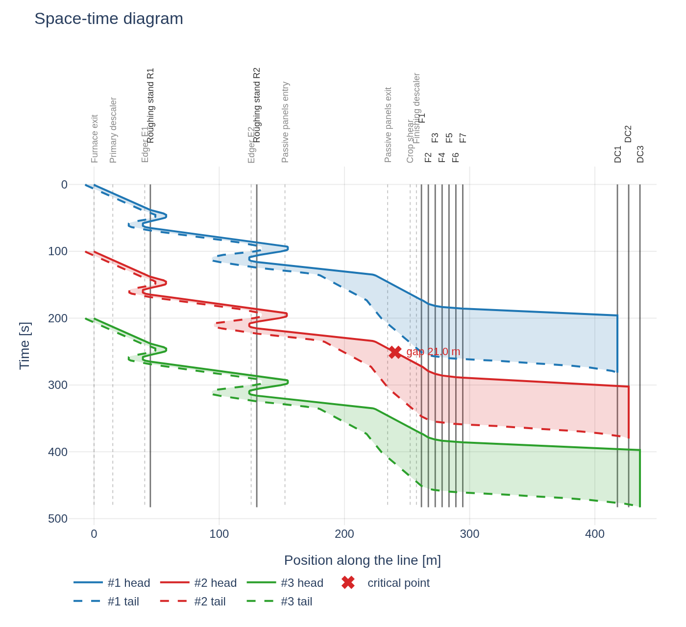
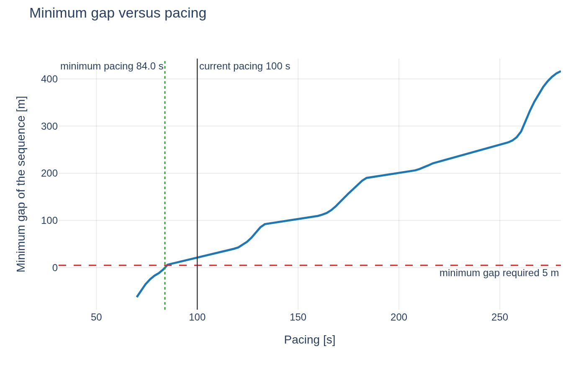

# hsmpace

Space-time diagram and pacing analysis for a **Hot Strip Mill**.

The tool draws the head and tail position of the pieces travelling along the line, checks that a
sufficient gap always remains between the tail of one piece and the head of the next, and determines
the minimum cadence at which pieces can enter the process.



## What it does

* **Space-time diagram**: position on the horizontal axis, like the plant layout, and time on the
  vertical axis increasing downwards. Every piece is a band between head and tail, so a collision
  reads as two bands touching rather than as four lines crossing.
* **Gap between pieces**, in metres and in seconds, with the critical point located by instant,
  position and section of the line. Every pair of pieces that coexists on the line is compared, not
  only the adjacent ones: with a reversing roughing mill the constraint often falls between piece N
  and N+2.
* **Minimum gap versus pacing curve**, from which the minimum feasible cadence and the margin being
  worked with are read directly.

  

* **Monte Carlo robustness**: probability of a violation once pass speeds, dead times and release
  instants have the dispersion they have in the plant.
* **Stand occupancy** as a Gantt chart and a full event log.
* **Comparison against measured tracking**, to validate the model on real data.

## How to use it

### Web interface

```bash
pip install -e .
hsmpace app                      # opens http://127.0.0.1:8731
```

The same application runs in two ways, and the choice can be deferred:

* **locally** on the machine of whoever uses it, as a process serving `127.0.0.1`: no server, no
  network, no port to open towards the outside;
* **on an office server**, with `hsmpace app --address 0.0.0.0`, with colleagues opening a URL.

If Python cannot be installed on the machine, the package can be bundled into a single executable with
PyInstaller and the behaviour stays identical.

### Command line

```bash
hsmpace template input.xlsx                  # empty template to fill in
hsmpace template example.xlsx --with-example # example already filled in
hsmpace run input.xlsx --scan --monte-carlo 2000 --excel results.xlsx
hsmpace to-json input.xlsx -o case.json      # contract for the Level 2 system
hsmpace run case.json --json report.json
```

`hsmpace run` returns 2 when the minimum gap drops below the threshold, so it can be used in checking
scripts.

## The model in two lines

**The head commands, the tail follows.** The user describes the speed changes of the extremity leading
in the current direction of travel; the speed of the other extremity follows from the mass flow balance
of the engaged stands:

```
v_trailing = v_leading / product of the lambdas        lambda = (h_in * w_in) / (h_out * w_out)
```

The discontinuities at engagement changes are physically correct: at **bite** the trailing extremity
stays continuous, because the body of the bar has mass and cannot change speed instantly, while the
leading one jumps by a factor lambda because it is gripped by the rolls; at **tail-out** the opposite
happens. With a schedule consistent with the mass flow balance, the jump at bite lands exactly on the
pass speed and produces no spurious ramps.

Motion is represented by **analytic segments** of uniform acceleration: trajectories are exact, the
chart has dozens of points instead of hundreds of thousands, and the instant at which the gap touches
the threshold is found by solving a quadratic equation rather than by sampling. A complete simulation
costs about 0.4 ms, which makes the pacing scan and the Monte Carlo essentially free. Details are in
[docs/algorithm-spec.md](docs/algorithm-spec.md).

Other conventions worth knowing:

* **Speed changes**: the distance written in a section is where the new speed must be **reached**, not
  where the ramp starts. The tool anticipates the ramp so that the piece is at speed exactly there, and
  reports the shortfall when there is not enough room. An event whose target position falls while a
  pass is engaged, or beyond a stand still to be engaged, is deferred to disengagement: a ramp cannot
  be planned across a pass because the bite resets the speed anyway.
* **Accelerations**, in order of precedence: the one written next to a speed change applies to that
  ramp only; while the piece is gripped, the one of the stand rolling it; while it is free, the one of
  the section it is in, or the global `table_accel_mps2` default.
* **Reversals**: the `reversing_delay_s` and `reversing_clearance_m` on a row describe the reversal
  that **follows** that pass, so the schedule reads downwards as "finish this pass, back off, wait,
  then go the other way". The `approach_v_mps` instead stays on the row of the pass it approaches.
  The clearance is measured from the stand, so increase it if the real constraint is the edger.
  Leaving it empty makes the piece stop as soon as the deceleration allows, at `v^2/(2a)`, and if the
  requested clearance is shorter than that distance the tool reports the one actually achieved rather
  than faking an impossible braking. This is not a detail: on the example mill, going from 0 to 20 m
  of clearance takes the minimum pacing from 105 to 148 seconds.
* **Zoom rolling**: keeps the opposite convention on purpose, the one of the offline model TRoll, so its
  trigger is where the acceleration **starts**. It uses the **virtual head**, that is it ignores the
  fact that the head stops at the coiler: if it falls beyond the coiler the zoom starts after a few
  wraps. The trigger is the virtual travel past the stand, **the same for every assigned coiler**:
  TRoll does not treat the downcoilers, so the number is not recomputed as table plus wraps on that
  mandrel. Pinning and the tail slowdown use the assigned coiler; the zoom ramp does not.
* **Arrival at the coiler**: the slowdown starts as late as possible so that the tail reaches the
  coiler at `coiler_v_final_mps`, using the acceleration on the coiler row. The constraint is on
  the tail; the command is on the leading extremity, scaled by the remaining elongation chain. If
  the tail is still in the finishing mill, the tandem slows down anyway. If even that is not
  enough, the tool reports the speed the tail actually arrives at.
* **Several coilers**: up to three in-line downcoilers, each at its own `x`. `coiler_pattern` on the
  Simulation sheet is a repeating cycle of their ids, the same idea as `piece_products`
  (`DC1,DC2` alternates). With two or three coilers the pattern is required and must name at least
  two of them. A piece assigned to a downstream coiler does not stop at the one upstream. Do not put
  the coiler on the product row: the same product often alternates.
* **Coiler**: on gripping, the physical head is pinned and the length on the line decreases, while the
  virtual head carries on.
* **Origin of the axis**: at release the head sits at the furnace exit and the tail one slab length
  further upstream, so the first few tens of metres of tail at negative values represent the slab still
  being extracted.

## The input file

An `.xlsx` without macros, read only: results always go to a separate file. Units are fixed in the
template and there is no unit column to fill in: **positions and lengths in m, thicknesses and widths
in mm, speeds in m/s, times in s, accelerations in m/s2**.

| Sheet | Content |
|---|---|
| `Info` | `schema_version`, mill name, notes |
| `Layout` | equipment with position, kind (`start`, `stand`, `coiler`, `marker`), acceleration, tandem group |
| `Sections` | line sections with their own acceleration and up to 7 speed changes each, given as a distance from the section start plus a speed |
| `Products` | slab dimensions and product data |
| `PassSchedule` | per pass: stand, direction, reduction, widths, speed, reversing delay and clearance, tandem master, zoom |
| `Simulation` | pacing, number of pieces, product sequence, coiler cycle, minimum gap, roller table acceleration, final speed at the coiler, scan and Monte Carlo parameters |

The `kind` column decides what the model does with a row, and `group` is functional rather than
informative: stands sharing a group label form a tandem, and inside it the pass flagged as `master`
sets the mass flow while the other speeds are recomputed from it. Acceleration is only read on `stand`
rows, where it applies while the piece is gripped, and on the `coiler` row, where it sets the final
slowdown. The `Guide` sheet inside the workbook explains all of this in place.

Sections need not match the spacing between stands: a physical section can be split into sub-sections
at any notable point. An event that would fire while a pass is engaged is **deferred to
disengagement**, because while rolling it is the mill that commands, not the roller table; putting
`YES` in `during_pass` makes it apply anyway.

Every input error is reported with sheet, cell and reason:

```
Invalid input (2 problems):
  - Layout!C5: x_m: 'twenty five' is not a number
  - PassSchedule!B4: product P1 pass 3: invalid reduction (135.0 -> 200.0 mm)
```

## Comparison against measured tracking

The **Measurements** tab accepts a CSV in the format

```
piece_id,time_s,head_m,tail_m
A1234,0.00,0.0,-10.5
A1234,0.50,0.6,-9.9
```

with `tail_m` optional and positions referred to the same origin as the layout. The measurements are
overlaid on the simulation, with an adjustable time shift to align the starting instants.

## What the tool does not do

Explicit choices, not oversights:

* **no interlocks and no hold points**: the pieces follow their nominal profiles and the tool reports
  where the gap drops below the threshold, without stopping the piece behind as the plant logic would;
* **no coilbox** (deferred: it is the only element that makes the piece point-like and swaps head and
  tail);
* roller slip neglected, infinite jerk, acceleration equal to deceleration;
* no speed constraint tied to a position window: that is expressed with sections and events;
* no thermal, roll force or spread model;
* furnace cadence and coiler cycle out of scope, to be assessed separately.

## Project structure

```
src/hsmpace/
  core/        calculation core in pure arithmetic, no external dependency
    kinematics.py   analytic segments, quadratic roots, difference of trajectories
    model.py        layout, sections, events, pass schedule, validation
    simulate.py     event-driven simulator
    analysis.py     gap, geometric extremities, mass balance
    studies.py      gap versus pacing curve, minimum pacing, Monte Carlo
    contract.py     JSON contract for input and output
    tracking.py     import of measured tracking
  io_excel/    Excel reading and writing (openpyxl)
  viz/         charts (plotly)
  app/         web interface (streamlit)
  cli.py       command line
```

The `core` package does not import openpyxl, plotly or streamlit, has no global state and is
deterministic: it is meant to be rewritten in C++ or C# for the Level 2 system following
[docs/algorithm-spec.md](docs/algorithm-spec.md). In the meantime a Level 2 system can already invoke
the executable passing a case as JSON.

## Development

```bash
pip install -e ".[dev]"
pytest
```

## Documents

* [docs/algorithm-spec.md](docs/algorithm-spec.md) - specification of the algorithm for the porting
* [docs/grill-review-hsm-pacing.md](docs/grill-review-hsm-pacing.md) - critical review of the project,
  open points and decisions taken
