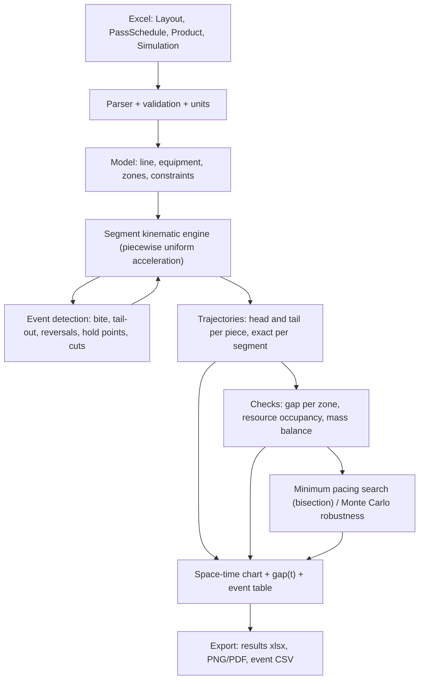

# Grill review — pacing tool / space-time diagram for a Hot Strip Mill

Critical interrogation of the project. Its purpose is to support a final review before a single line of
code is written. Questions marked **[BLOCKING]** change the architecture: implementing without an
answer makes no sense. Those marked **[TO DECIDE]** only change scope or priority.

---

## 0. Short verdict, ahead of the questions

Three strong statements, to be attacked if you disagree:

1. **The right language is Python.** Not out of taste, but because 90% of the value of this tool sits
   in reading Excel, interactive charts and fast iteration on the model. C++ and C# cost 3 to 5 times
   the code for no benefit: the actual computational load of this problem is negligible (see §8). The
   only valid reason for C# is a corporate IT constraint on deployment (see Q6).

2. **Do not use a fixed step integrator.** The correct model is an **analytic segment** engine
   (piecewise uniformly accelerated motion) with **event detection** through the roots of quadratic
   equations. The reason: most events are *position driven* (the head reaches the stand), not time
   driven, and a fixed dt introduces a tracking error worth 20 mm/ms at 20 m/s. With segments the error
   is zero and the chart has dozens of points instead of hundreds of thousands.

3. **The real output is not "do they collide, yes or no", it is "how much margin do I have".** In a
   real plant the interlocks stop the piece before impact: the collision never happens, it turns into
   waiting and lost throughput. If the tool only says "collision" you are modelling a scenario that L1
   and L2 prevent by construction. See Q2, the most important question of all.

---

## 1. Blocking questions

### Q1 [BLOCKING] — Plant scope and configuration
The model changes considerably depending on what sits inside the boundary.

- Where the space axis starts: **furnace extraction**? The discharge roller table? The primary descaler?
- Where it ends: **the coilers**? The end of the run-out table? The finishing mill exit?
- Roughing mill: **one reversing stand (R2)**? Two (non reversing R1 plus reversing R2)? A non reversing
  roughing tandem? Attached or independent edgers?
- **Is there a coilbox?** If so, it is a brutal topological event: the bar is coiled head first and
  uncoiled tail first, so **head and tail swap**. All downstream tracking inverts, and the crop shear
  cuts what used to be the tail. A tool that does not handle it is systematically wrong on the
  finishing mill.
- Steckel or plain tandem finishing mill?
- How many coilers, and is there a **selector** choosing between them?

### Q2 [BLOCKING] — What the model does when the gap closes
Three different semantics, three different architectures:

- **(a) Open-loop / diagnostic**: the two pieces follow their independent nominal speed profiles, the
  tool draws the curves and flags where `gap < gap_min` (possibly with overlap, that is a physically
  impossible interpenetration which is nonetheless visually useful). Simple, deterministic, excellent
  for sizing the pacing. Cost: low.
- **(b) Closed-loop / with interlocks**: you model the **hold points** (waiting positions: ahead of the
  shear, at the head of the transfer table, before the finishing descaler) and the logic "piece B does
  not enter zone Z until A has cleared it". Output = **induced delay** and effective cadence. Far more
  realistic and far closer to what you see in the plant, but it requires a supervisory logic layer and
  the definition of the mutual exclusion zones. Cost: medium to high.
- **(c) Both**: open-loop as an analysis mode, closed-loop as a simulation mode.

Blunt question: **do you need a diagram drawer or a plant simulator?** If the answer is "I want to
determine the ideal pacing", I strongly suspect you need (c), because the ideal pacing is the one for
which the induced delay is zero with a margin, not the one for which the gap is exactly zero.

### Q3 [BLOCKING] — Mode of use and numerical objective
- **Verification**: given a pacing T, tell me whether it is feasible and with what minimum margin.
- **Optimisation**: find the **smallest feasible T** (bisection on the pacing: about 20 simulations,
  negligible cost) for a given `gap_min`.
- **Robustness**: given T, how likely is a violation if speeds have a tolerance of +/-x% and the dead
  times (reversal, screwdown, shear, coil transfer) are dispersed? This is Monte Carlo, about 10^4 runs
  in a few seconds with a segment engine.

Which of these do you need at delivery, and which is nice to have? Careful: (3) is the one that in
practice avoids the stoppages, because the theoretical minimum pacing is always inapplicable without a
margin.

### Q4 [BLOCKING] — Really only 2 pieces?
I challenge you on this. On an HSM with a reversing roughing mill and a coilbox there are typically
**3 to 4 pieces on the line at once**: one in the finishing mill, one on the transfer table or in the
coilbox, one in roughing, one just extracted from the furnace. The constraint that sets the pacing is
often **not** between piece N and N+1 but between N and N+2 (classic example: R2 has to reverse and its
backward stroke occupies the zone the next piece is entering, while the piece in front still occupies
the transfer table).

The cost of generalising to **N pieces** is almost nil if done from day 1 (a list of pieces plus a
pairwise check), and it is a painful refactoring if you hardcode 2 (names like `pieceA`/`pieceB`
everywhere, four curve charts, binary gap criteria). **Proposal: generic N, default display 2 to 3.**
Do you agree, or do you have a reason to limit it to 2?

### Q5 [BLOCKING] — Where the speeds come from
This determines the format of the pass schedule sheet.

- Are speeds given as **strip speed** (m/s at the stand exit) or as **roll rpm**? If rpm, the *worn*
  roll diameter is needed together with the **forward slip** coefficient (typically 2 to 8%):
  `v_exit = pi*D*n*(1+f)`. Do you want f as a per pass input, as a model, or as a constant?
- Mass flow balance: do you give the speed of the *master* stand and let the others follow
  (`v_out = v_in * (h_in*w_in)/(h_out*w_out)`), or do you give all the speeds and let the tool **check**
  the consistency of the mass balance and flag discrepancies? The second is very useful as a sanity
  check on real schedules.
- **Spread** in roughing: do we neglect it (constant w), do you give it per pass, or do you want a model
  (Sparling / Beese)? Neglecting it overestimates the elongation by a few per cent.
- Can you export a **real Level 2 setup** to Excel? If so, the input format should look like that one,
  not like a format invented by me.

### Q6 [BLOCKING] — How your colleagues will launch it
This question decides the language more than any technical consideration.

- **Standalone executable** (Python plus PyInstaller, an `.exe` to copy, no installation, no admin
  rights) — my default recommendation in an industrial environment.
- **Internal web app** (Streamlit/Dash on an office server, opened from a browser, zero installation on
  the clients, centralised updates) — the best option if you have a server and the network allows it.
- **Excel add-in** (xlwings): input, output and chart all stay inside the sheet. Maximum familiarity for
  your colleagues, but it requires Python installed or a signed add-in, and it ties you to the quirks
  of Excel and COM.
- **Python script** run by whoever knows how (you).
- **C# / WinForms-WPF**: it only makes sense if the IT policy effectively forbids Python, or if the tool
  later has to live inside an existing .NET ecosystem (HMI, department tools already in C#).

A side question with real weight: are your colleagues' PCs on the office network or on a **level 2/3
plant network** with restrictions? Do they have admin rights? Does an unsigned `.exe` get past the
corporate antivirus?

### Q7 [TO DECIDE] — Do you have real data for validation
The tool is worth little if nobody believes its numbers. If you can export real tracking (IBA PDA, HMI
trends, L2 logs: head and tail positions, stand speeds, bite and tail-out timestamps), the
**"overlay simulated versus measured"** feature is the single one that takes the tool from "the
engineer's toy" to "a department instrument". Do you have it? In what format (CSV, IBA dat, database)?

---

## 2. Grilling the kinematic model

Points that do not appear in the initial description and that will bite during implementation.

1. **Head and tail have different speeds during a pass.** While the piece is *inside* the stand the tail
   advances at `v_in` and the head at `v_out = lambda * v_in`. You cannot model "the position of the
   piece" and derive the extremities from it: you must **integrate head and tail separately**, with
   length as a derived variable. Your point (3) brushes against this, but the practical consequence is
   that the model has at least 2 degrees of freedom per piece, not 1.

2. **In a tandem the piece is in several stands at once.** With F1 to F7 the strip can be gripped by
   seven stands simultaneously: the head speed is the exit of the *last* engaged stand, the tail speed
   the entry of the *first*. Every bite and every tail-out is a discrete event that rewrites the law of
   motion. A "one stand at a time" model **does not work** on the finishing mill.

3. **Reversal: material head and tail versus geometric front and rear.** On an even numbered pass the
   "nose" that advances is the material tail. The collision criterion is **not**
   `x_tail(A) - x_head(B)`: it is `min(x_head_A, x_tail_A) - max(x_head_B, x_tail_B)`. If you write the
   check the naive way, during reverse passes the tool will tell you everything is fine exactly at the
   moment of maximum risk.

4. **The head "stops" at the coiler.** After the mandrel grips it, `x_head` stays constant while the
   tail keeps going: the length on the line *decreases*. Without handling this, the head of the coil
   ends up at 1200 m on a 400 m long plant and the chart becomes unreadable.

5. **The lengths involved.** Slab 8 to 12 m, transfer bar 30 to 80 m, strip beyond 1000 m: the space
   axis must cope with the piece being longer than the plant. Consequence on the chart: head and tail do
   not fit the same visual scale without care.

6. **Roller table speed zones.** Outside the stands the piece takes the speed of the roller zone. But if
   the piece spans 3 zones with different setpoints, which one commands? The one holding most of the
   mass? The first? An explicit rule is needed, otherwise the model is ambiguous exactly on the transfer
   table, where much of the pacing is played out.

7. **Slip on the rollers.** A heavy, cold slab on rollers: the real speed is not the roller speed. Do you
   want a slip factor per zone, or do you consider it negligible and absorb it in the margins?

8. **Ramps: acceleration and jerk.** You mentioned ramps versus steps. Steps are convenient but they
   overestimate throughput: the acceleration times of the drive on a roughing stand are not negligible.
   At least `a_acc` and `a_dec` per axis are needed, and it must be decided whether jerk is limited too.
   Question: **do you know the ramps per drive**, or do they have to be estimated?

9. **Dead time of the reversal.** A reversal is not instantaneous: deceleration to zero, gap change
   (screwdown), possible edger positioning, re-acceleration. Does the screwdown time overlap the
   deceleration or is it in series? On real plants this difference is worth seconds per pass, that is
   tens of seconds on the pacing.

10. **Position dependent speed constraints.** The descaler requires a maximum descaling speed inside a
    spatial window. The crop shear requires a cutting speed at a fixed position. The model must support
    "in this interval of x the speed is constrained", which is a position driven event, not a time
    driven one.

11. **Shear: the length changes discontinuously.** Head and tail crop shorten the piece by a few hundred
    millimetres instantly. If you also do a dividing cut (double length slab, two coils from one piece),
    **a new piece is born** halfway through the simulation: your 2 piece model becomes a 3 piece one. Do
    you want to support that?

12. **Accelerated rolling (zoom rolling).** On the finishing mill the speed is ramped during rolling to
    keep the finishing temperature constant. This is not a detail: it changes the occupancy time of the
    finishing mill and therefore the pacing. Do we model it (a ramp on F7 with its coefficients) or do we
    assume a constant rolling speed?

13. **Thermal.** The waiting time on the transfer table is not free: it is constrained by the finishing
    mill entry temperature. An "optimal" pacing that lengthens the wait on the transfer table can be
    thermally unacceptable. A full thermal model is out of scope, but a **maximum dwell time per zone**
    costs little and prevents meaningless results. Do you want it?

14. **Upstream and downstream constraints that often *are* the bottleneck**: maximum furnace extraction
    rate (heating capacity), and the coiler cycle (cut, coil transfer, mandrel change) which for short
    or thick coils can be more limiting than the mill. If the tool ignores these two, it produces an
    "ideal" pacing the plant cannot serve.

---

## 3. Collision and conflict criteria: subtler than "gap > 0"

- The minimum gap **is not a single number**: it differs by zone (ahead of the shear, at the descaler
  entry, on the transfer table). It has to be tabulated per zone.
- There are conflicts **without contact**: two pieces cannot be in the same equipment (descaler, shear,
  stand) even with an adequate gap; the coiler is busy until the coil transfer completes; the travel
  zone of the reversing mill must be clear *over its whole stroke*, not only where the piece happens to
  be at that instant. This is a **resource occupancy check**, conceptually different from a distance
  check.
- The gap operators care about is often **temporal** ("how many seconds between the tail of A and the
  head of B at point X"), not spatial. Better to compute and show both.
- A numerical check must also catch the pathological cases: overtaking (physically impossible, but a
  symptom of wrong input), negative length, violation of mass conservation (`L*h*w` constant within
  tolerance). These must be **explicit errors**, not strange looking charts.

---

## 4. Excel input: where it breaks in your hands

- **How many sheets and who maintains them?** Minimum proposal: `Layout` (absolute positions and type of
  each piece of equipment, zone lengths, zone speeds, accelerations), `PassSchedule` (per pass: stand,
  h_in, h_out, width, speed or rpm, direction, dead times), `Product` (slab dimensions, steel grade),
  `Simulation` (pacing, gap_min per zone, options). Does the split work for you, or do you already have
  one in use?
- **Who is the source of truth?** If the tool writes results into the same file, your colleagues will
  send you files with old results and new inputs. Recommendation: **read-only input plus output in a
  separate file** (or a clearly marked, regenerated sheet).
- **Schema versioning**: put a `schema_version` field in a cell from day 1. Without it, by the third
  format change you will have 15 variants floating around the office and no way to tell them apart.
- **Fierce validation on input**: empty cells, mixed units (mm versus m, m/s versus m/min versus rpm),
  non monotonic positions, reductions inconsistent with the final thickness, comma versus dot decimal
  separator, text cells that look like numbers, hidden rows, merged cells. The tool must reject an
  ambiguous input with a message stating **sheet, cell and reason**, not throw a traceback.
- **Units**: do I fix them in the template (SI: m, m/s, s) or do I accept a unit column? A rigid template
  is far more robust; a unit column is more convenient. Preference?
- Plain `.xlsx`, or do you need `.xlsm` with existing macros?

---

## 5. The chart: what it really has to show

- The classic **railway timetable** convention: time on the X axis, position on the Y axis, because
  slopes then read as speeds. You wrote "space and time": do you confirm time on X?
- For each piece **two curves** (head and tail) with the area between them filled, giving the envelope
  of the piece. A collision then becomes visually "the two bands touch", far more readable than four
  lines.
- Horizontal lines for the equipment (furnace, descaler, R1, R2, shear, F1 to F7, coilers).
- Secondary chart: **gap(t)** with the `gap_min` threshold and the violation points highlighted.
- Useful extras: a Gantt chart of equipment occupancy, and a table of events (bite, tail-out, reversals,
  cuts) with timestamps.
- Interactive (zoom, hover with values) or static to paste into a report? If it has to go into
  PowerPoint, a decent resolution PNG/PDF export is needed too.

---

## 6. Proposed architecture

The heart is the segment engine: every stretch of motion is `x(t) = x0 + v0*t + 0.5*a*t^2`, therefore

- trajectories are **exact** (no integration error),
- the chart has dozens of points instead of hundreds of thousands (Plotly does not suffer),
- the gap between two pieces is itself piecewise quadratic: the first instant of violation is found
  **analytically** by solving `gap(t) = gap_min`, accurate to the microsecond,
- one simulation costs microseconds, so bisection on the pacing and Monte Carlo become free.

The engine must be **separated from the UI and from the Excel I/O** (a pure library plus adapters),
otherwise it is not testable and can never be called from anywhere else (a spreadsheet, a batch job, a
notebook).

---

## 7. What I would leave out of v1

To keep the project from dying of scope creep:

- a complete thermal model and a roll force/torque model;
- a physical spread model (use the widths from the schedule);
- a multi-product optimiser over the whole rolling programme (coffin schedule);
- a graphical layout editor;
- direct integration with L2 or a database.

All sensible things, **after** the kinematic core has been validated on real data.

---

## 8. Performance: where the problem is NOT (and where it is)

Orders of magnitude, to be corrected with your data:

- a complete sequence lasts about 200 to 400 s of real time, with roughly 50 to 200 events per piece;
- with analytic segments, one simulation is O(number of events): microseconds to milliseconds;
- bisection for the minimum pacing: about 20 simulations. A Monte Carlo of 10^4 runs: seconds.

So the bottleneck **is not the computation**. It is:

- **the rendering**, if you get the approach wrong: sampling at 1 ms over 600 s for N pieces and 2 curves
  means millions of points and an unusable UI. With segments the problem disappears.
- **the time to open Excel** with openpyxl on large, heavily formatted files (seconds). Mitigated by
  reading in `read_only`/`data_only` mode.
- **human time**: if the cycle "edit Excel, rerun, look at the chart" takes more than about 5 seconds,
  the tool will not be used to explore scenarios. That is the real performance requirement.

---

## 9. Main risks

1. **Garbage in, garbage out**: the result is worth as much as the input speed profiles. Without
   validation against real tracking nobody will trust the pacing number that comes out.
2. **Wrong model semantics** (open-loop versus interlocks, Q2): you risk building an instrument that
   answers a different question from the one being asked in the meeting.
3. **The real constraint is elsewhere**: the furnace or the coiler, not the mill. The tool would be
   formally correct and practically useless.
4. **Hardcoding 2 pieces**: an expensive refactoring once you discover the constraint is between N and
   N+2.
5. **Deployment**: if your colleagues cannot launch it (IT policy, antivirus, no Python), the project is
   dead regardless of the quality of the model.
6. **Diverging Excel formats**: without `schema_version` and validation, support will eat you alive.

---

## 10. Checklist of edge cases to keep under control

- [ ] Piece longer than the distance between two stands (simultaneous multiple engagement).
- [ ] Bar longer than the transfer table.
- [ ] Tail still in the last roughing pass while the head is already at the shear.
- [ ] Head already coiled while the tail is still in F1 (strip under tension across the whole mill).
- [ ] Idle / dummy pass (zero reduction).
- [ ] Odd versus even number of passes at the reversing mill (exit direction).
- [ ] Coilbox: head and tail swap.
- [ ] Dividing cut / double slab: a new piece born at runtime.
- [ ] Head and tail crop: discontinuous length.
- [ ] Reversal while the next piece is approaching (maximum risk).
- [ ] Different products in sequence (different thicknesses and widths -> different cycles -> the pacing
      is not constant along the programme).
- [ ] First and last piece of the programme (no predecessor or successor).
- [ ] A pacing so wide that the pieces never interact (the tool must say so, not stay silent).
- [ ] A pacing so tight that the violation already happens at furnace extraction.
- [ ] Negative speeds or lengths, non monotonic stand positions, reduction above 100%.
- [ ] Mass balance not conserved within tolerance (inconsistent input).
- [ ] Constant width versus spread (impact on elongation).
- [ ] Overlap between screwdown time and deceleration at the reversal.
- [ ] Descaling speed constraint inside a spatial window.
- [ ] Maximum dwell time for thermal reasons.
- [ ] Coiler cycle (cut plus coil transfer) as a cadence constraint.
- [ ] Maximum furnace extraction rate.

---

## 11. Summary of the answers I need

| # | Question | Why it blocks |
|---|----------|---------------|
| Q1 | Line scope and configuration (single or double reversing stand, coilbox, coilers) | Defines the data model and the topological events |
| Q2 | Open-loop diagnostic versus closed-loop with interlocks | It is the main architectural choice |
| Q3 | Verification / minimum pacing optimisation / stochastic robustness | Defines the output and the UI |
| Q4 | Fixed 2 pieces or generic N | Very cheap now, expensive later |
| Q5 | Speeds: m/s or rpm plus slip; master plus mass balance or all explicit; spread | Defines the Excel schema |
| Q6 | Deployment: exe / internal web / Excel add-in / script; IT constraints | Decides the language |
| Q7 | Availability of real tracking data for validation | Decides the credibility of the tool |

Answer the blocking ones alone and I will produce the detailed implementation plan.

---

## 12. Answers received and technical consequences

**Q1 - Complete line (furnace to coilers), roughing mill with R1 and R2 both reversing and with edgers,
coilbox present.**

This is the worst of the possible configurations, in the sense of the richest in constraints:

- Two reversing stands in series means **two travel envelopes** to keep mutually exclusive. During the
  reverse passes of R2 the material tail of the bar climbs back towards R1, and if R1 is working the
  next piece the two look each other in the eye. This is exactly the N versus N+2 case and it confirms
  that limiting the analysis to 2 pieces would have been a mistake.
- The **coilbox is a buffer**: it partly decouples the roughing cadence from the finishing one, so the
  optimal pacing is not set by a single bottleneck but by the worst among roughing, coilbox and
  finishing plus coiler. The tool must say **which** constraint is active, otherwise you optimise the
  wrong thing.
- Inside the coilbox the piece is not a segment: it is **a point**. Head and tail coincide with the
  coilbox position and the length on the line is zero. A dedicated state is needed, and on uncoiling the
  extremities swap.

**Q2 - Both modes (open-loop diagnostic plus closed-loop with interlocks).**

Fine, but it brings an extra layer: definition of the **exclusive occupancy zones**, of the **hold
points** and of the release logic. One detail that looks minor and is not: a piece that has to stop at a
hold point must **start braking earlier**, at a distance of `v^2/(2a)`. If the model stops it
instantaneously at the point, it systematically overestimates throughput precisely in the tight
scenarios, which are the ones you care about.

**Q3 - Verification plus minimum pacing plus robustness, all three.**

Consistent with the analytic segment engine: verification is one simulation, minimum pacing is a
bisection (about 20 simulations), robustness is Monte Carlo (10^4 simulations). The Excel file must
however also carry the **dispersions**: tolerance on the speeds and distribution of the dead times
(reversal, screwdown, shear, coil transfer). Without those numbers the robustness mode has no input.

**Q4 - Generic N pieces.** No downside, just work done properly from the start.

**Q5 - All speeds explicit, the tool checks the mass balance. Here I contest the choice.**

In roughing it works: one stand at a time, the bar between R1 and R2 is free, and if the speeds you give
are inconsistent with the reductions the only result is a final length different from the geometric one,
which the tool tells you. In the **finishing tandem it does not**: the strip between F1 and F2 has a
*fixed* length imposed by geometry, so the mass balance is not a check, it is a **hard physical
constraint**. If you give seven inconsistent speeds, in reality the plant answers with tension or with
loops on the loopers, and beyond a point it tears the strip or cobbles. A tool that merely "flags" and
then simulates impossible trajectories produces wrong numbers precisely in the fastest part of the
plant.

Proposed behaviour (default, overridable): in roughing the explicit speeds command and the mass balance
is a check with a tolerance; in the tandem a **master stand** is chosen (typically the last one, F7, or
the one setting the finishing temperature) and the other speeds are **recomputed by mass flow**, with a
table showing the deviation from the ones entered. That way you immediately see whether your schedule is
self consistent, and the simulation stays physical.

**Q6 - Internal web app, with doubts about the IT restrictions, and in perspective a library for the
Level 2 department (C++/C#).**

Two heavy architectural consequences:

- The doubt about IT is resolved by **not choosing**. The same web application can run (a) on an office
  server with colleagues opening a URL, or (b) **locally on the colleague's PC**, as a process serving
  `127.0.0.1` in the browser already installed. In case (b) no server, no network and no open port are
  needed: bundled as an executable, not even Python is needed. We build (b) right away, which is also
  how it gets developed, and (a) comes for free once IT authorises it. The three questions to put to IT
  anyway are: can an unsigned `.exe` run from the user profile, can Python or a portable distribution be
  installed, is there an internal server with an already defined HTTP publishing policy.
- The future library for the Level 2 system is a **portability** requirement, and it must be honoured
  from the start or it will never be true: the calculation core must be **pure arithmetic**, without
  numpy or pandas, without hidden state, deterministic, with an input/output contract in **JSON** and a
  **written specification** of the algorithm. That way the port to C++/C# is mechanical work and, in the
  meantime, the Level 2 system can already invoke the executable passing JSON. Pandas and Plotly stay
  confined to the Excel and UI layers, which will not be ported.

**Q7 - Real data exists but is hard to extract.**

Not blocking, but let us define the comparison CSV format **now** (timestamp, piece id, head position,
tail position, speed, events) and leave the hook in the UI. When you manage to extract a real tracking
run, the "simulated versus measured" feature is an afternoon of work instead of a refactoring.

---

## 13. Project decisions adopted as defaults

All of them overridable, but they are needed to avoid semantic holes in the model.

- **D1 - State of the piece**: two degrees of freedom (material head and tail), length derived. The
  geometric front and rear extremities are computed, never assumed.
- **D2 - Gap**: `min(head_A, tail_A) - max(head_B, tail_B)`, valid during reversals too. The `gap_min`
  threshold defined **per zone**. Both spatial and temporal gaps reported.
- **D3 - Commanding zone**: outside the stands, the speed is the one of the zone containing the front
  extremity, limited by any constraint window (descaling) overlapping the piece. An explicit,
  configurable rule.
- **D4 - Engaged stands**: `v_head` = exit of the last engaged stand, `v_tail` = entry of the first.
  Every bite and tail-out is an event.
- **D5 - Tandem**: mass flow imposed by the master stand; deviations from the entered speeds reported.
- **D6 - Coilbox**: dedicated state, point-like piece, head and tail swap on uncoiling, coiling, dwell
  and uncoiling times as parameters.
- **D7 - Coiler**: on gripping, the head is pinned; the length on the line decreases; the coiler cycle
  (cut, coil transfer) occupies the resource and constrains the cadence.
- **D8 - Hold points**: braking anticipated by `v^2/(2a)`, never an instantaneous stop.
- **D9 - Units**: SI internally (m, s, m/s, kg). The Excel file accepts practical units declared in the
  header (mm, m/min) and converts on input.
- **D10 - I/O**: read-only Excel input with `schema_version`; results in a separate file. No writing into
  the input file.
- **D11 - Portable core**: pure arithmetic, JSON contract, written specification for the future L2
  porting.

---

## 14. Revision of 31 August: clarifications and updated decisions

### 14.1 The model is head driven (supersedes point 6)

The most important clarification: **there are no zone setpoints**. The user describes the motion through
**speed change events referred to the head**, and the tool derives the effect on the tail wherever it
happens to be. This removes the "commanding zone" ambiguity (D3 falls away) and simplifies the model.

The tail derivation rule is the only piece of physics needed:

- no stand between tail and head: rigid body, `v_tail = v_head`;
- stands engaged between tail and head: `v_tail = v_head / prod(lambda_i)`, with
  `lambda_i = (h_in*w_in)/(h_out*w_out)`.

It holds identically for a single roughing pass and for a tandem with several engaged stands. Every bite
adds a factor to the chain, every tail-out removes one: at tail-out the tail speed has a **step**, which
is physically correct and must not be smoothed.

**Sections**: the line is divided into user defined sections, not necessarily bounded by the stands; a
physical section can be split into sub-sections at notable points. Every speed change is given as a
**distance from the start of the section** plus a target speed, up to **7 per section**. If an event
fires while the previous ramp is still running, the ramp is simply re-targeted: that is not an error.

One point remains ambiguous: on **reverse passes** the extremity that advances is the material tail. See
question R1 at the end.

### 14.2 Points closed

- **Point 7 - roller slip**: neglected. Removed from the model.
- **Point 8 - ramps**: infinite jerk, acceleration equal to deceleration, defined per axis, default
  1 m/s2.
- **Point 9 - reversal**: a single `reversing delay` per pass, which the user fills in accounting for
  screwdown and side guide centring. No separate modelling of the two contributions.
- **Point 10 - speed constraints over a spatial window**: out of scope. Shear and descaler are handled
  with sections and speed events.
- **Point 11 - zoom rolling**: present, in the convention of the offline model. Speed increment in
  **per cent**, start of acceleration set by the **position of the head past the last stand**. The
  trigger uses the **virtual head**, that is the position the head would have if it kept advancing,
  ignoring the stop at the coiler. This is intentional: if the coiler is at 80 m and the trigger at
  100 m, the zoom starts after a few wraps. The **physical** head does stay pinned at the coiler for the
  chart and for the gap computation: the two positions coexist in the model, under distinct names.
- **Point 13 - thermal**: out of scope, input data assumed sound.
- **Point 14 - furnace and coiler**: out of scope, bottlenecks assessed separately.
- **Section 4 - Excel**: plain `.xlsx` without macros, units **fixed upstream in the template**, no unit
  column. D9 updated accordingly.
- **Section 5 - chart**: **position on X, time on Y** (horizontal layout convention), **vertical** lines
  for the equipment, a filled band instead of two lines, interactive with zoom and hover, Gantt of
  occupancy confirmed, high resolution PNG export.

**Answers to the residual questions**: the speed events are anchored to the extremity leading in the
current direction, with an override column; units as proposed (m, mm, m/s, s, m/s2); time increasing
downwards.

### 14.3 Scope changes

- **Q2 revised: open-loop only.** No interlocks, hold points, anticipated braking or automatic waiting.
  D8 falls away, and with it an entire layer of the project. A positive and non obvious consequence: the
  pieces become **completely decoupled**, so every product is simulated **once** and the copies are
  placed at time offsets. The natural deliverable is no longer a single number but the **minimum gap
  versus pacing curve**, computable in one go, with the position, instant and section of the critical
  point. The minimum feasible pacing is read off the curve.
- **Coilbox deferred to phase 2.** I confirm this is the right call: it is the only element that
  introduces a special topological state (point-like piece and head/tail swap). The v1 target is a
  conventional layout. I leave the extension point in the state machine, but no code for now.
- **Q5 confirmed**: in the tandem the speeds follow from a master stand by mass flow, with a report of
  the deviations from the entered values.

---

## 15. Outcome of the implementation

### 15.1 Where the decisions ended up

| Decision | Where it lives |
|---|---|
| Analytic segments, quadratic roots, difference of trajectories | `src/hsmpace/core/kinematics.py` |
| Mass flow chain, discontinuities at bite and tail-out, reversals, zoom on the virtual head | `src/hsmpace/core/simulate.py` |
| Layout, sections, events, validation with locators | `src/hsmpace/core/model.py` |
| Gap with geometric extremities, time gap, mass balance | `src/hsmpace/core/analysis.py` |
| Gap versus pacing curve, minimum pacing, Monte Carlo | `src/hsmpace/core/studies.py` |
| Excel reading with errors referred to the cell | `src/hsmpace/io_excel/reader.py` |
| JSON contract for the future Level 2 system | `src/hsmpace/core/contract.py` and `docs/algorithm-spec.md` |

### 15.2 The bug the grilling missed

The test suite turned up one that none of the questions had anticipated: **two consecutive passes on the
same stand in the same direction were biting at the very same instant**. Right after a bite the leading
extremity sits exactly on the stand, so the crossing condition of the next pass was satisfied at zero
distance. The simulator produced plausible but meaningless motion instead of stopping. Fixed with a
geometric guard (the stand must still be ahead) and a diagnostic that names the unreachable pass.

It is the most insidious kind of error in a tool like this: it does not raise an exception, it produces a
number.

### 15.3 What the tool says about the example mill

With the example layout (R1 and R2 reversing, three passes each, seven stand finishing mill, 757 m coil)
and a 5 m minimum gap, the **minimum feasible pacing comes out at 105 s**, and the critical point falls
**upstream of R1, a few metres from the furnace exit**. The mechanism is the one anticipated in point 3
of chapter 2: the reverse pass on R2 brings the tail of the bar back almost to the furnace, and when the
bar sets off forward again for its last pass it does so from standstill, hence slowly, exactly while the
next slab is being extracted. The constraint is not in the mill, it is at the point where the piece
enters.

It is worth noting what this implies: **the pacing is limited by an interference that no intuition puts
where it actually is**. Someone looking at the plant thinks of the shear or of the finishing mill
entrance, not of two metres from the furnace.

### 15.4 Reversing clearance: parameter added after the review

In the first draft the point at which the piece stops to reverse **was not an input**: the piece started
decelerating at tail-out and stopped wherever it happened to, that is at the braking distance `v^2/(2a)`
from the stand. On the example that gave 3.1 m on the first pass, a number coming from the drive and not
from a process choice. Wrong: in the plant the clearance is a given, it has to account for the edger as
well, and it weighs on the cycle time.

It is now the `reversing_clearance_m` column of the `PassSchedule` sheet, with the same convention as
`reversing_delay_s`: it belongs to the pass that follows the reversal. The piece keeps a constant speed
and brakes so as to stop exactly there. If the requested clearance is shorter than the braking distance,
the tool reports the clearance actually achieved instead of faking an impossible braking; leaving the
cell empty keeps the "stop as soon as possible" behaviour.

How much it weighs, on the example mill:

| Clearance | Piece cycle | Minimum pacing |
|---|---|---|
| 0 m (shortest braking) | 232.8 s | 105.3 s |
| 5 m | 234.7 s | 107.2 s |
| 10 m | 248.2 s | 121.8 s |
| 20 m | 272.5 s | 148.6 s |

Forty seconds of pacing between the two extremes, that is roughly 40% of throughput: it was a first order
parameter disguised as an implementation detail.

While implementing it, a missing structural rule also surfaced: a schedule that **ends with a reverse
pass** leaves the piece moving backwards and never reaching the coiler. It is now rejected in validation,
as was already the case for a reverse first pass.

### 15.5 Second review of the input file, 2 September

Reading the workbook raised five questions, and four of them turned out to be real behaviours the
guide did not explain rather than misunderstandings.

**The `group` column is functional, not informative.** It is the switch that enables the tandem mass
flow balance. Emptying it does not raise anything, it simply goes back to using the seven entered
speeds verbatim, that is it silently allows a non physical schedule in the finishing mill. Now
documented in the guide together with the values and the meaning of the `kind` column.

**One semantics for speed changes.** The distance written in a section is now the position where the
target must be **reached**, not where the ramp starts, and the ramp is anticipated accordingly. This
makes the tool consistent with the reversal stop, which already worked that way, so there is one rule
to remember instead of two. Two consequences worth stating: a ramp is never planned across a rolling
pass, because the bite would reassign the speed anyway, and when only the anticipation reaches back
into the pass the ramp does start during rolling, which is a real manoeuvre, and is reported.

**Zoom rolling keeps the opposite convention on purpose.** Its trigger is where the acceleration
starts, because that is how the offline model defines it. Being the one exception, it is called out
explicitly in the guide.

**Acceleration had no rule, now it has one.** It used to be whatever the last device to take command
had set, which meant the transfer table inherited the acceleration of the roughing stand. Now: the
value next to a speed change applies to that ramp only, the stand governs while the piece is gripped,
the section or the global default governs while it is free. As a side effect the acceleration on the
layout is read only on `stand` rows and on the `coiler` row; on `start` and `marker` rows it was being
ignored, so the template now leaves it blank there.

**The reversal convention was backwards.** The delay and the clearance now belong to the pass the
reversal **follows**, so the schedule reads downwards as "finish this pass, back off, wait, then go the
other way". The approach speed stays on the row of the pass it approaches, by explicit preference. A
value written where no reversal follows is reported as a non blocking warning.

**New: the strip slows down before the coiler**, so that the tail arrives at a configurable final
speed using the deceleration declared on the coiler row. Here the arithmetic of the example did not
work out: from 13.5 m/s over the 107 m of run-out table, 0.3 m/s2 would land the tail at 10.9 m/s and
0.85 m/s2 would be needed to reach 1 m/s. The template keeps 0.3 as the default and the example mill
uses 0.9, so that the shipped example does not open with a permanent warning.

### 15.6 What is still missing, in order of usefulness

1. **Validation on real tracking**: the CSV format and the comparison in the UI are there, the data is
   not. Until the simulated is overlaid on the measured, the minimum pacing stays a number from a model.
2. **Coilbox** (phase 2): point-like piece and head/tail swap.
3. **Real multi-product sequences**: the code handles them, but the example workbook has a single
   product. On a real rolling programme the pacing is not constant along the sequence.
4. **Interlocks and hold points**, if one day the induced delay is needed instead of the diagnosis alone.
5. **Bundling into an executable**, once it is clear what IT allows.
