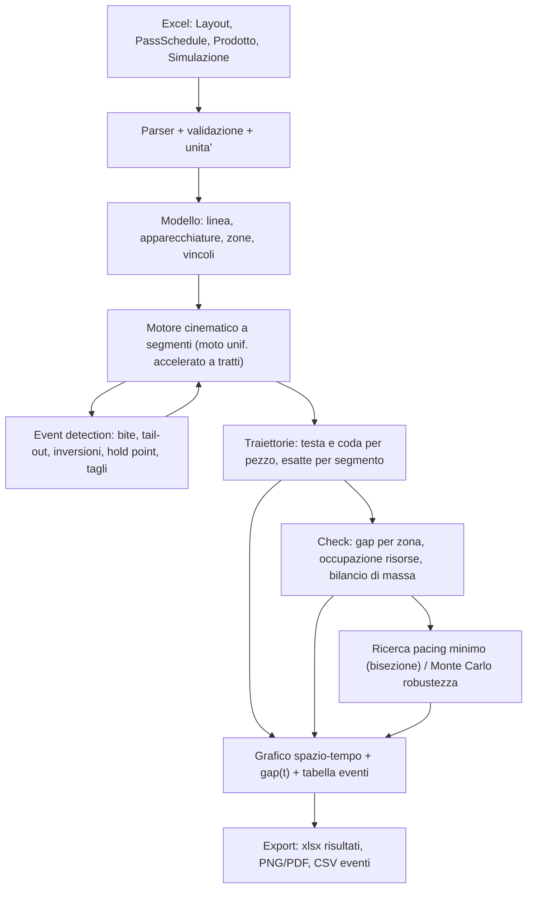

# Grill Review — Tool di pacing / diagramma spazio-tempo per Hot Strip Mill

Documento di interrogatorio critico sul progetto. Serve a farti una review finale prima di scrivere una
riga di codice. Le domande marcate **[BLOCCANTE]** cambiano l'architettura: senza risposta non ha senso
implementare. Quelle marcate **[DA DECIDERE]** cambiano solo funzionalita' o priorita'.

---

## 0. Verdetto sintetico (prima delle domande)

Tre affermazioni forti, da attaccare se non sei d'accordo:

1. **Il linguaggio giusto e' Python.** Non per gusto, ma perche' il 90% del valore del tool sta in
   lettura Excel, grafici interattivi e iterazione veloce sul modello. C++ e C# ti costano 3-5x di codice
   per zero vantaggio: il carico computazionale reale di questo problema e' irrisorio (vedi §8). L'unica
   ragione valida per C# e' un vincolo IT aziendale sul deployment (vedi Q6).

2. **Non usare un integratore a passo fisso.** Il modello corretto e' un motore **a segmenti analitici**
   (moto uniformemente accelerato a tratti) con **event detection** per radici di equazioni di 2° grado.
   Motivo: la maggior parte degli eventi e' *guidata dalla posizione* (la testa arriva alla gabbia), non
   dal tempo, e un dt fisso introduce un errore di tracking che a 20 m/s vale 20 mm/ms. Con i segmenti,
   l'errore e' zero e il grafico ha decine di punti invece di centinaia di migliaia.

3. **Il vero output non e' "si scontrano si/no", e' "quanto margine ho".** Su un impianto reale gli
   interblocchi fermano il pezzo prima dell'urto: la collisione non avviene mai, si traduce in attesa e
   in perdita di produttivita'. Se il tool dice solo "collisione" stai modellando uno scenario che la
   L1/L2 impedisce per costruzione. Vedi Q2, e' la domanda piu' importante di tutte.

---

## 1. Domande bloccanti

### Q1 [BLOCCANTE] — Perimetro dell'impianto e configurazione
Il modello cambia parecchio a seconda di cosa sta dentro il confine.

- Dove inizia l'asse spaziale: **estrazione dal forno**? Scivolo/roller table di uscita? Descaler primario?
- Dove finisce: **avvolgitori**? Fine ROT? Uscita gabbia finitrice?
- Sbozzatore: **una gabbia reversibile (R2)**? Due (R1 non reversibile + R2 reversibile)? Un tandem
  di sbozzatura non reversibile? Edger accoppiati o indipendenti?
- **Coilbox presente?** Se si', e' un evento topologico brutale: il bar viene avvolto testa-prima e
  svolto coda-prima, quindi **testa e coda si scambiano**. Tutto il tracking a valle si inverte, e la
  cesoia crop taglia quella che era la coda. Se il tool non lo gestisce, sbaglia sistematicamente sul
  finitore.
- Steckel o finitore tandem puro?
- Quanti avvolgitori e c'e' uno **shifting/deviatore** che li seleziona?

### Q2 [BLOCCANTE] — Cosa fa il modello quando il gap si chiude
Tre semantiche diverse, tre architetture diverse:

- **(a) Open-loop / diagnostico**: i due pezzi seguono il loro profilo di velocita' nominale indipendente,
  il tool disegna le curve e segnala dove `gap < gap_min` (eventualmente con sovrapposizione, quindi
  "compenetrazione" fisicamente impossibile ma visivamente utile). Semplice, deterministico,
  ottimo per dimensionare il pacing. Costo: basso.
- **(b) Closed-loop / con interblocchi**: modelli i **hold point** (punti di attesa: davanti alla cesoia,
  in testa alla via a rulli di trasferimento, prima del descaler F0) e la logica "il pezzo B non entra in
  zona Z finche' A non l'ha liberata". Output = **ritardo indotto** e cadenza effettiva. Molto piu'
  realistico e molto piu' vicino a cio' che vedi in impianto, ma richiede un layer di logica
  supervisiva e la definizione delle zone di mutua esclusione. Costo: medio-alto.
- **(c) Entrambi**: open-loop come modalita' di analisi, closed-loop come modalita' di simulazione.

Domanda secca: **ti serve un disegnatore di diagrammi o un simulatore di impianto?** Se la risposta e'
"voglio determinare il pacing ideale", sospetto fortemente che serva (c), perche' il pacing ideale e'
quello per cui il ritardo indotto e' zero con un margine, non quello per cui il gap e' esattamente zero.

### Q3 [BLOCCANTE] — Modalita' d'uso e obiettivo numerico
- **Verifica**: dato un pacing T, dimmi se e' fattibile e con che margine minimo.
- **Ottimizzazione**: trova il **minimo T fattibile** (bisezione sul pacing: ~20 simulazioni, costo
  trascurabile) dato un `gap_min`.
- **Robustezza**: dato T, quanto e' probabile la violazione se le velocita' hanno tolleranza ±x% e i
  tempi morti (inversione, screwdown, cesoia, trasferimento coil) hanno dispersione? Questa e' Monte
  Carlo, ~10^4 run in pochi secondi con il motore a segmenti.

Quale di queste ti serve alla consegna, e quale e' "nice to have"? Attenzione: la (3) e' quella che in
pratica evita i fermi, perche' il pacing teorico minimo e' sempre inapplicabile senza margine.

### Q4 [BLOCCANTE] — Davvero solo 2 pezzi?
Ti sfido su questo punto. Su un HSM con sbozzatore reversibile e coilbox, in linea ci sono tipicamente
**3-4 pezzi contemporaneamente**: uno in finitura, uno sul trasferimento/coilbox, uno in sbozzatura,
uno appena estratto dal forno. Il vincolo che determina il pacing spesso **non e'** tra il pezzo N e
N+1, ma tra N e N+2 (esempio classico: R2 deve invertire e la sua corsa all'indietro impegna la zona
dove sta arrivando il pezzo successivo, mentre il pezzo davanti occupa ancora il trasferimento).

Il costo di generalizzare a **N pezzi** e' quasi nullo se lo si fa dal giorno 1 (lista di pezzi + check
a coppie adiacenti), ed e' un refactoring doloroso se hardcodi 2 (nomi tipo `pieceA`/`pieceB` ovunque,
grafici a 4 curve, criteri di gap binari). **Proposta: N generico, default di visualizzazione 2-3.**
Sei d'accordo o hai una ragione per limitare a 2?

### Q5 [BLOCCANTE] — Da dove arrivano le velocita'
Questo determina il formato della scheda Excel della pass schedule.

- Le velocita' sono date come **velocita' del nastro** (m/s all'uscita gabbia) o come **giri rulli
  (rpm)**? Se rpm, serve il diametro rullo *usurato* e il **coefficiente di avanzamento / forward slip**
  (tipicamente 2-8%): `v_uscita = pi*D*n*(1+f)`. Vuoi f come input per passata, come modello, o
  costante?
- Il bilancio di massa: la velocita' della gabbia *master* la dai tu e le altre discendono
  (`v_out = v_in * (h_in*w_in)/(h_out*w_out)`), oppure dai tutte le velocita' e il tool **verifica** la
  coerenza del bilancio di massa segnalando incongruenze? La seconda e' molto utile come sanity check
  su schedule reali.
- **Allargamento (spread)** in sbozzatura: lo trascuriamo (w costante), lo dai per passata, o vuoi un
  modello (Sparling / Beese)? Se lo trascuri, sovrastimi l'allungamento di qualche punto percentuale.
- Puoi esportare una **setup reale dal Livello 2** in Excel? Se si', il formato di input dovrebbe
  assomigliare a quello, non a un formato inventato da me.

### Q6 [BLOCCANTE] — Come lo lanciano i colleghi
Questa domanda decide il linguaggio piu' di qualsiasi considerazione tecnica.

- **Eseguibile standalone** (Python + PyInstaller, un `.exe` da copiare, niente installazioni, niente
  admin) — la mia raccomandazione di default in ambiente industriale.
- **Web app interna** (Streamlit/Dash su un server di ufficio, si apre da browser, zero installazioni
  sui client, aggiornamenti centralizzati) — la migliore se avete un server e la rete lo consente.
- **Add-in Excel** (xlwings): input e output restano dentro il foglio, il grafico anche. Massima
  familiarita' per i colleghi, ma richiede Python installato o un add-in firmato, e ti lega alle
  bizzarrie di Excel/COM.
- **Script Python** eseguito da chi sa farlo (tu).
- **C# / WinForms-WPF**: ha senso solo se la policy IT vieta di fatto Python e/o se il tool deve poi
  girare dentro un ecosistema .NET esistente (HMI, tool di reparto gia' in C#).

Domanda collaterale ma pesante: i PC dei colleghi sono su rete d'ufficio o su rete di **livello 2/3
d'impianto** con restrizioni? Hanno diritti di admin? Un `.exe` non firmato passa l'antivirus aziendale?

### Q7 [DA DECIDERE] — Hai dati reali per validare
Il tool vale poco se nessuno crede ai suoi numeri. Se puoi esportare tracking reale (IBA PDA, trend
HMI, log L2: posizioni testa/coda, velocita' gabbie, timestamp di bite/tail-out), la funzione
**"sovrapponi simulato vs misurato"** e' il singolo feature che fa passare il tool da "giocattolo
dell'ingegnere" a "strumento di reparto". Ce li hai? In che formato (CSV, dat IBA, database)?

---

## 2. Grilling sul modello cinematico

Punti che nel testo iniziale non compaiono e che ti mordono in fase di implementazione.

1. **Testa e coda hanno velocita' diverse durante la passata.** Finche' il pezzo e' *dentro* la gabbia,
   la coda avanza a `v_in` e la testa a `v_out = lambda * v_in`. Non puoi modellare "la posizione del
   pezzo" e derivare gli estremi: devi **integrare testa e coda separatamente**, con la lunghezza come
   variabile derivata. Il tuo punto (3) lo sfiora, ma la conseguenza pratica e' che il modello ha
   almeno 2 gradi di liberta' per pezzo, non 1.

2. **In tandem il pezzo e' in piu' gabbie insieme.** Con F1..F7 il nastro puo' essere ingaggiato da 7
   gabbie simultaneamente: la velocita' della testa e' l'uscita dell'*ultima* gabbia ingaggiata, quella
   della coda l'ingresso della *prima*. Ogni bite e ogni tail-out e' un evento discreto che cambia la
   legge di moto. Il modello a "una gabbia per volta" **non funziona** sul finitore.

3. **Inversione: testa e coda materiali vs anteriore/posteriore geometrico.** Alla passata pari il
   "muso" che avanza e' la coda materiale. Il criterio di collisione **non e'** `x_coda(A) - x_testa(B)`:
   e' `min(x_testa_A, x_coda_A) - max(x_testa_B, x_coda_B)`. Se scrivi il check nel modo ingenuo,
   durante le passate inverse il tool ti dira' che va tutto bene proprio nel momento di rischio massimo.

4. **La testa si "ferma" all'avvolgitore.** Dopo la presa sul mandrino, `x_testa` resta costante mentre
   la coda continua: la lunghezza in linea *diminuisce*. Se non lo gestisci, la testa del coil finisce a
   1200 m su un impianto lungo 400 m e il grafico diventa illeggibile.

5. **Lunghezze in gioco.** Bramma 8-12 m, bar 30-80 m, nastro fino a >1000 m: l'asse spazio deve
   reggere il fatto che il pezzo e' piu' lungo dell'impianto. Conseguenza sul grafico: coda e testa non
   stanno nella stessa scala visiva senza accorgimenti.

6. **Zone di velocita' della via a rulli.** Fuori dalle gabbie il pezzo prende la velocita' della zona
   rulli. Ma se il pezzo copre 3 zone con setpoint diversi, chi comanda? La zona con piu' massa? La
   prima? Serve una regola esplicita, altrimenti il modello e' ambiguo proprio nel trasferimento, dove
   si gioca gran parte del pacing.

7. **Slittamento sui rulli.** Bramma pesante e fredda su rulli: la velocita' reale non e' quella dei
   rulli. Vuoi un fattore di slittamento per zona, o lo consideri trascurabile e lo assorbi nei margini?

8. **Rampe: accelerazione e jerk.** Hai citato rampe vs scalini. Gli scalini sono comodi ma
   sovrastimano la produttivita': i tempi di accelerazione dell'azionamento su una gabbia sbozzatrice
   non sono trascurabili. Serve almeno `a_acc` e `a_dec` per asse (gabbia/zona), e va deciso se limitare
   anche il jerk. Domanda: **le rampe le conosci per azionamento** o vanno stimate?

9. **Tempi morti dell'inversione.** L'inversione non e' istantanea: decelerazione a zero, cambio gap
   (screwdown), eventuale posizionamento edger, riaccelerazione. Il tempo di screwdown si sovrappone
   alla decelerazione o e' in serie? Su impianti reali questa differenza vale secondi per passata, cioe'
   decine di secondi sul pacing.

10. **Vincoli di velocita' posizione-dipendenti.** Il descaler richiede una velocita' massima di
    descagliatura in una finestra spaziale. La cesoia crop richiede una velocita' di taglio a una
    posizione fissa. Il modello deve supportare "in questo intervallo di x la velocita' e' vincolata",
    che e' un evento posizione-guidato, non temporale.

11. **Cesoia: la lunghezza cambia in modo discontinuo.** Crop testa e crop coda accorciano il pezzo di
    x00 mm istantaneamente. Se fai anche taglio a meta' (bramma doppia lunghezza / due coil da un
    pezzo), nasce **un pezzo nuovo** a meta' simulazione: il tuo modello a 2 pezzi diventa a 3.
    Lo vuoi supportare?

12. **Rolling accelerato (zoom rolling).** Sul finitore la velocita' viene rampata durante la
    laminazione per tenere costante la FDT. Non e' un dettaglio: cambia il tempo di occupazione del
    finitore e quindi il pacing. Lo modelliamo (rampa di F7 con relativi coefficienti) o assumiamo
    velocita' costante di laminazione?

13. **Termico.** Il tempo di attesa sul trasferimento non e' libero: e' vincolato dalla temperatura di
    ingresso finitore. Un pacing "ottimo" che allunga l'attesa sul trasferimento puo' essere
    inaccettabile termicamente. Un modello termico completo e' fuori scope, ma un **vincolo di tempo
    massimo di permanenza per zona** costa poco ed evita risultati privi di senso. Lo vuoi?

14. **Vincoli a monte e a valle che spesso *sono* il collo di bottiglia**: cadenza massima di estrazione
    dal forno (capacita' termica), e ciclo dell'avvolgitore (taglio, trasferimento coil, cambio
    mandrino) che per coil corti/spessi puo' limitare piu' del laminatoio. Se il tool ignora questi
    due, produce un pacing "ideale" che l'impianto non riesce a servire.

---

## 3. Criteri di collisione e di conflitto: piu' sottili di "gap > 0"

- Il gap minimo **non e' un numero unico**: e' diverso per zona (davanti alla cesoia, in ingresso
  descaler, sul trasferimento). Va tabellato per zona.
- Esistono conflitti **senza contatto**: due pezzi non possono stare nella stessa apparecchiatura
  (descaler, cesoia, gabbia) neanche con gap adeguato; l'avvolgitore e' occupato finche' non finisce il
  trasferimento coil; la zona di corsa del reversibile deve essere libera *in tutta l'escursione* della
  passata, non solo dove sta il pezzo in quell'istante. Questo e' un **check di occupazione di risorse**,
  concettualmente diverso dal check di distanza.
- Il gap che interessa gli operatori spesso e' **temporale** ("quanti secondi tra coda di A e testa di B
  al punto X"), non spaziale. Meglio calcolare e mostrare entrambi.
- Un check numerico deve rilevare anche i casi patologici: sorpasso (fisicamente impossibile, ma
  sintomo di input errato), lunghezza negativa, violazione della conservazione della massa
  (`L*h*w` costante entro tolleranza). Questi devono essere **errori espliciti**, non grafici strani.

---

## 4. Input Excel: dove ti si rompe in mano

- **Quante schede e chi le mantiene?** Proposta minima: `Layout` (posizioni assolute e tipo di ogni
  apparecchiatura, lunghezza zone, velocita' zone, accelerazioni), `PassSchedule` (per passata: gabbia,
  h_in, h_out, larghezza, velocita' o rpm, verso, tempi morti), `Prodotto` (dimensioni bramma, acciaio,
  numero coil), `Simulazione` (pacing, gap_min per zona, opzioni). Ti torna la suddivisione o ne hai
  gia' una in uso?
- **Chi e' la fonte di verita'?** Se il tool scrive risultati dentro lo stesso file, i colleghi ti
  manderanno file con risultati vecchi e input nuovi. Consiglio: **input read-only + output in file
  separato** (o foglio chiaramente marcato e rigenerato).
- **Versioning dello schema**: metti un campo `schema_version` in una cella fin dal giorno 1. Senza,
  al terzo cambio formato hai 15 varianti in giro per l'ufficio e nessun modo di distinguerle.
- **Validazione feroce all'ingresso**: celle vuote, unita' di misura miste (mm vs m, m/s vs m/min vs
  rpm), posizioni non monotone, somma delle riduzioni incoerente con lo spessore finale, virgola vs
  punto decimale, celle testo che sembrano numeri, righe nascoste, celle unite. Il tool deve rifiutare
  un input ambiguo con un messaggio che indica **foglio, cella e motivo**, non lanciare un traceback.
- **Unita' di misura**: le fisso io nel template (SI: m, m/s, s) o accetto una colonna unita'? Il
  template rigido e' molto piu' robusto; la colonna unita' e' piu' comoda. Preferenza?
- `.xlsx` puro, o dovete usare `.xlsm` con macro esistenti?

---

## 5. Il grafico: cosa deve mostrare davvero

- Convenzione classica del **diagramma orario ferroviario**: tempo sull'asse X, posizione sull'asse Y,
  perche' le pendenze si leggono come velocita'. Tu hai scritto "spazio e tempo": confermi tempo su X?
- Per ogni pezzo **due curve** (testa e coda) con la banda di area riempita tra le due = ingombro del
  pezzo. La collisione diventa visivamente "le due bande si toccano", molto piu' leggibile di 4 linee.
- Linee orizzontali per le apparecchiature (forno, descaler, R1, R2, cesoia, F1..F7, avvolgitori).
- Grafico secondario: **gap(t)** con la soglia `gap_min` e i punti di violazione evidenziati.
- Utile in piu': Gantt di occupazione delle apparecchiature, e tabella eventi (bite, tail-out,
  inversioni, tagli) con timestamp.
- Interattivo (zoom, hover con valori) o statico da incollare in un report? Se serve incollarlo in
  PowerPoint, serve anche export PNG/PDF a risoluzione decente.

---

## 6. Architettura proposta

Il cuore e' il motore a segmenti: ogni tratto di moto e' `x(t) = x0 + v0*t + 0.5*a*t^2`, quindi

- le traiettorie sono **esatte** (nessun errore di integrazione),
- il grafico ha decine di punti invece di centinaia di migliaia (Plotly non soffre),
- il gap tra due pezzi e' anch'esso quadratico a tratti: il primo istante di violazione si trova
  **analiticamente** risolvendo `gap(t) = gap_min`, con precisione al microsecondo,
- una simulazione costa microsecondi, quindi bisezione sul pacing e Monte Carlo diventano gratis.

Il motore deve essere **separato dalla UI e dall'I/O Excel** (libreria pura + adattatori), altrimenti
non e' testabile e non potra' mai essere richiamato da altro (foglio, batch, notebook).

---

## 7. Cosa NON metterei nella v1

Per evitare che il progetto muoia di scope creep:

- modello termico completo e modello di forza/coppia di laminazione;
- modello di allargamento fisico (usa larghezze da schedule);
- ottimizzatore multi-prodotto sull'intero programma di laminazione (coffin schedule);
- editor grafico del layout;
- integrazione diretta con L2/database.

Tutte cose sensate **dopo** che il nucleo cinematico e' validato su dati reali.

---

## 8. Performance: dove NON e' il problema (e dove lo e')

Numeri d'ordine di grandezza, da correggere con i tuoi dati:

- una sequenza completa e' ~200-400 s di tempo reale, con ~50-200 eventi per pezzo;
- con i segmenti analitici, una simulazione e' O(numero eventi): microsecondi-millisecondi;
- bisezione sul pacing minimo: ~20 simulazioni. Monte Carlo 10^4 run: secondi.

Quindi il collo di bottiglia **non e' il calcolo**. Lo e':

- **il rendering** se sbagli approccio: campionare a 1 ms per 600 s x N pezzi x 2 curve significa
  milioni di punti e una UI inutilizzabile. Con i segmenti il problema sparisce.
- **il tempo di apertura di Excel** con openpyxl su file grossi e pieni di formattazione (secondi).
  Si mitiga leggendo in `read_only`/`data_only`.
- **il tempo umano**: se il ciclo "modifico Excel, rilancio, guardo il grafico" dura piu' di ~5 secondi,
  il tool non verra' usato per esplorare scenari. Questo e' il vero requisito di performance.

---

## 9. Rischi principali

1. **Garbage in, garbage out**: il risultato vale quanto i profili di velocita' in ingresso. Senza
   validazione su tracking reale nessuno si fidera' del numero di pacing che esce.
2. **Semantica sbagliata del modello** (open-loop vs interblocchi, Q2): rischi di costruire uno
   strumento che risponde a una domanda diversa da quella che ti fanno in riunione.
3. **Il vincolo vero e' altrove**: forno o avvolgitore, non laminatoio. Il tool sarebbe formalmente
   corretto e praticamente inutile.
4. **Hardcoding di 2 pezzi**: refactoring costoso quando scoprirai che il vincolo e' N vs N+2.
5. **Deployment**: se i colleghi non riescono a lanciarlo (policy IT, antivirus, niente Python), il
   progetto e' morto a prescindere dalla qualita' del modello.
6. **Formato Excel divergente**: senza `schema_version` e validazione, il supporto ti mangera' vivo.

---

## 10. Checklist di edge case da tenere sotto controllo

- [ ] Pezzo piu' lungo della distanza tra due gabbie (ingaggio multiplo simultaneo).
- [ ] Bar piu' lungo del tavolo di trasferimento.
- [ ] Coda ancora nell'ultima passata di sbozzatura mentre la testa e' gia' alla cesoia.
- [ ] Testa gia' avvolta mentre la coda e' ancora in F1 (nastro in tiro su tutto il finitore).
- [ ] Passata a vuoto / dummy pass (riduzione nulla).
- [ ] Numero dispari vs pari di passate al reversibile (verso di uscita).
- [ ] Coilbox: scambio testa/coda.
- [ ] Taglio a meta' / doppia bramma: nasce un pezzo nuovo a runtime.
- [ ] Crop testa e coda: lunghezza discontinua.
- [ ] Inversione mentre il pezzo successivo si sta avvicinando (rischio massimo).
- [ ] Prodotti diversi in sequenza (spessori/larghezze diverse -> cicli diversi -> il pacing non e'
      costante lungo il programma).
- [ ] Primo e ultimo pezzo del programma (nessun predecessore/successore).
- [ ] Pacing cosi' largo che i pezzi non interagiscono mai (il tool deve dirlo, non tacere).
- [ ] Pacing cosi' stretto che la violazione avviene gia' all'estrazione dal forno.
- [ ] Velocita' o lunghezze negative, gabbie in posizione non monotona, riduzione > 100%.
- [ ] Bilancio di massa non conservato entro tolleranza (input incoerente).
- [ ] Larghezza costante vs allargamento (impatto sull'allungamento).
- [ ] Sovrapposizione tra tempo di screwdown e decelerazione all'inversione.
- [ ] Vincolo di velocita' di descagliatura in finestra spaziale.
- [ ] Tempo massimo di permanenza per motivi termici.
- [ ] Ciclo avvolgitore (taglio + trasferimento coil) come vincolo di cadenza.
- [ ] Cadenza massima di estrazione dal forno.

---

## 11. Riepilogo delle risposte che mi servono

| # | Domanda | Perche' blocca |
|---|---------|----------------|
| Q1 | Perimetro linea e configurazione (reversibile singolo/doppio, coilbox, avvolgitori) | Definisce il modello dati e gli eventi topologici |
| Q2 | Open-loop diagnostico vs closed-loop con interblocchi | E' la scelta architetturale principale |
| Q3 | Verifica / ottimizzazione del pacing minimo / robustezza stocastica | Definisce l'output e la UI |
| Q4 | 2 pezzi fissi o N generico | Costo bassissimo ora, alto dopo |
| Q5 | Velocita': m/s o rpm+slip; master + bilancio di massa o tutte esplicite; spread | Definisce lo schema Excel |
| Q6 | Deployment: exe / web interna / add-in Excel / script; vincoli IT | Decide il linguaggio |
| Q7 | Disponibilita' di dati reali di tracking per validazione | Decide la credibilita' del tool |

Rispondi anche solo alle bloccanti e produco il piano di implementazione dettagliato.

---

## 12. Risposte ricevute e conseguenze tecniche

**Q1 - Linea completa (forno -> avvolgitori), sbozzatore con R1 e R2 entrambe reversibili e con edger,
coilbox presente.**

E' la configurazione peggiore delle possibili, nel senso di piu' ricca di vincoli:

- Due gabbie reversibili in serie significano **due envelope di corsa** da tenere mutuamente esclusive.
  Durante le passate inverse di R2 la coda materiale del bar risale verso R1, e se R1 sta lavorando il
  pezzo successivo i due si guardano in faccia. Questo e' esattamente il caso N vs N+2 e conferma che
  limitare a 2 pezzi sarebbe stato un errore.
- Il **coilbox e' un buffer**: disaccoppia parzialmente la cadenza di sbozzatura da quella di finitura,
  quindi il pacing ottimo non e' determinato da un unico collo di bottiglia ma dal peggiore tra
  sbozzatura, coilbox e finitura+avvolgitore. Il tool deve dire **quale** vincolo e' attivo, altrimenti
  ottimizzi la cosa sbagliata.
- Nel coilbox il pezzo non e' un segmento: e' **un punto**. Testa e coda coincidono con la posizione del
  coilbox e la lunghezza in linea e' zero. Serve uno stato dedicato, e allo svolgimento gli estremi si
  scambiano.

**Q2 - Entrambe le modalita' (open-loop diagnostica + closed-loop con interblocchi).**

Va bene, ma comporta un layer aggiuntivo: definizione delle **zone a occupazione esclusiva**, dei
**hold point** e della logica di rilascio. Un dettaglio che sembra minore e non lo e': un pezzo che deve
fermarsi a un hold point deve **iniziare a frenare prima**, alla distanza `v^2/(2a)`. Se il modello lo
fa fermare istantaneamente al punto, sovrastima la produttivita' in modo sistematico proprio negli
scenari stretti, che sono quelli che ti interessano.

**Q3 - Verifica + pacing minimo + robustezza, tutti e tre.**

Coerente con il motore a segmenti analitici: la verifica e' una simulazione, il pacing minimo e' una
bisezione (~20 simulazioni), la robustezza e' Monte Carlo (10^4 simulazioni). Serve pero' che l'Excel
porti anche le **dispersioni**: tolleranza sulle velocita' e distribuzione dei tempi morti (inversione,
screwdown, cesoia, trasferimento coil). Senza quei numeri la modalita' robustezza non ha input.

**Q4 - N pezzi generico.** Nessuna conseguenza negativa, solo lavoro fatto bene dall'inizio.

**Q5 - Tutte le velocita' esplicite, il tool verifica il bilancio di massa. Qui ti contesto la scelta.**

In sbozzatura funziona: una gabbia per volta, il bar tra R1 e R2 e' libero, se le velocita' che dai
sono incoerenti con le riduzioni il risultato e' solo una lunghezza finale diversa da quella geometrica,
e il tool te lo segnala. Nel **finitore tandem no**: il nastro tra F1 e F2 ha lunghezza *fissa* imposta
dalla geometria, quindi il bilancio di massa non e' una verifica, e' un **vincolo fisico duro**. Se dai
sette velocita' incoerenti, nella realta' l'impianto risponde con tiro o con anse sui looper, e oltre
un certo punto strappa il nastro o fa cobble. Un tool che si limita a "segnalare" e poi simula
traiettorie impossibili produce numeri sbagliati proprio nella zona piu' veloce dell'impianto.

Comportamento che propongo (default, sovrascrivibile): in sbozzatura le velocita' esplicite comandano e
il bilancio di massa e' un check con tolleranza; nel tandem si sceglie una **gabbia master** (tipicamente
l'ultima, F7, o quella che detta la FDT) e le altre velocita' vengono **ricalcolate per mass flow**,
mostrando in tabella lo scostamento rispetto a quelle inserite. Cosi' vedi subito se la tua schedule e'
autoconsistente, e la simulazione resta fisica.

**Q6 - Web app interna, con dubbi sulle restrizioni IT, e in prospettiva una libreria per l'ufficio L2
(C++/C#).**

Due conseguenze pesanti sull'architettura:

- Il dubbio sull'IT si risolve **non scegliendo**. La stessa applicazione web puo' girare (a) su un
  server d'ufficio con i colleghi che aprono un URL, oppure (b) **in locale sul PC del collega**, come
  processo che apre `127.0.0.1` sul browser gia' installato. Nel caso (b) non serve server, non serve
  rete, non serve aprire porte: se poi la si impacchetta come eseguibile, non serve neanche Python.
  Costruiamo (b) subito, che e' anche il modo in cui si sviluppa, e (a) diventa gratis quando l'IT
  autorizza. Le domande da girare all'IT sono comunque tre: si puo' eseguire un `.exe` non firmato dal
  profilo utente, si puo' installare Python o una distribuzione portabile, esiste un server interno con
  policy di pubblicazione HTTP gia' definita.
- La libreria futura per il Livello 2 e' un requisito di **portabilita'**, e va rispettato da subito o
  non sara' mai vero: il nucleo di calcolo deve essere **aritmetica pura**, senza numpy/pandas, senza
  stato nascosto, deterministico, con un contratto di ingresso/uscita in **JSON** e una **specifica
  scritta** dell'algoritmo. Cosi' il porting in C++/C# e' un lavoro meccanico e, nel frattempo, il
  Livello 2 puo' gia' invocare l'eseguibile passando JSON. Pandas e Plotly restano confinati nei layer
  Excel e UI, che non verranno portati.

**Q7 - Dati reali esistono ma sono difficili da estrarre.**

Non blocca, ma definiamo **subito** il formato CSV di confronto (timestamp, id pezzo, posizione testa,
posizione coda, velocita', eventi) e lasciamo il gancio nella UI. Quando riuscirai a estrarre un
tracking reale, la funzione "simulato vs misurato" e' un pomeriggio di lavoro invece di un refactoring.

---

## 13. Decisioni di progetto adottate come default

Sono tutte sovrascrivibili, ma servono per non lasciare buchi semantici nel modello.

- **D1 - Stato del pezzo**: due gradi di liberta' (testa e coda materiali), lunghezza derivata. Gli
  estremi geometrici anteriore/posteriore sono calcolati, mai assunti.
- **D2 - Gap**: `min(testa_A, coda_A) - max(testa_B, coda_B)`, valido anche in inversione. Soglia
  `gap_min` definita **per zona**. Si riportano sia il gap spaziale sia quello temporale.
- **D3 - Zona comandante**: fuori dalle gabbie, la velocita' e' quella della zona che contiene
  l'estremita' anteriore, limitata da eventuali finestre di vincolo (descagliatura) sovrapposte al
  pezzo. Regola esplicita e configurabile.
- **D4 - Gabbie ingaggiate**: `v_testa` = uscita dell'ultima gabbia ingaggiata, `v_coda` = ingresso
  della prima. Ogni bite e tail-out e' un evento.
- **D5 - Tandem**: mass flow imposto da gabbia master; scostamenti dalle velocita' inserite riportati.
- **D6 - Coilbox**: stato dedicato, pezzo puntiforme, scambio testa/coda allo svolgimento, tempi di
  avvolgimento/sosta/svolgimento come parametri.
- **D7 - Avvolgitore**: alla presa la testa si blocca; la lunghezza in linea decresce; il ciclo
  avvolgitore (taglio, trasferimento coil) occupa la risorsa e vincola la cadenza.
- **D8 - Hold point**: frenata anticipata alla distanza `v^2/(2a)`, mai arresto istantaneo.
- **D9 - Unita'**: SI interno (m, s, m/s, kg). L'Excel accetta unita' pratiche dichiarate
  nell'intestazione (mm, m/min) e converte in ingresso.
- **D10 - I/O**: input Excel read-only con `schema_version`; risultati in file separato. Nessuna
  scrittura nel file di input.
- **D11 - Nucleo portabile**: aritmetica pura, contratto JSON, spec scritta per il futuro porting L2.

---

## 14. Revisione del 31/08: chiarimenti e decisioni aggiornate

### 14.1 Il modello e' comandato dalla testa (supera il punto 6)

Il chiarimento piu' importante: **non esistono setpoint di zona**. L'utente descrive il moto con **eventi
di cambio velocita' riferiti alla testa**, e il tool ne deriva l'effetto sulla coda ovunque essa sia.
Questo elimina l'ambiguita' della "zona comandante" (D3 decade) e semplifica il modello.

La regola di derivazione della coda e' l'unico pezzo di fisica che serve:

- nessuna gabbia tra coda e testa: corpo rigido, `v_coda = v_testa`;
- gabbie ingaggiate tra coda e testa: `v_coda = v_testa / Π λ_i`, con `λ_i = (h_in·w_in)/(h_out·w_out)`.

Vale identica per la singola passata in sbozzatura e per il tandem con piu' gabbie ingaggiate. Ogni bite
aggiunge un fattore alla catena, ogni tail-out lo toglie: al tail-out la coda ha un **gradino** di
velocita', che e' fisicamente corretto e non va smussato.

**Sezioni**: la linea e' divisa in sezioni definite dall'utente, non necessariamente delimitate dalle
gabbie; una sezione fisica puo' essere spezzata in sotto-sezioni in punti notevoli. Ogni cambio di
velocita' e' dato come **distanza dall'inizio della sezione** piu' velocita' target, fino a **7 per
sezione**. Se un evento scatta mentre la rampa precedente e' ancora in corso, la rampa viene ri-puntata
al nuovo target: non e' un errore.

Un solo punto resta ambiguo: nelle **passate inverse** l'estremita' che avanza e' la coda materiale.
Vedi domanda R1 in fondo.

### 14.2 Punti chiusi

- **Punto 7 - slittamento sui rulli**: trascurato. Rimosso dal modello.
- **Punto 8 - rampe**: jerk infinito, accelerazione = decelerazione, definite per asse, default 1 m/s².
- **Punto 9 - inversione**: un unico `reversing delay` per passata, che l'utente popola tenendo conto di
  screwdown e centraggio sideguides. Nessuna modellazione separata dei due contributi.
- **Punto 10 - vincoli di velocita' per finestra spaziale**: fuori scope. Cesoia e descagliatore si
  gestiscono con sezioni ed eventi di velocita'.
- **Punto 11 - zoom rolling**: presente, nella convenzione del modello offline. Delta di velocita' in
  **%**, inizio accelerazione fissato dalla **posizione della testa dopo l'ultima gabbia**. Il trigger
  usa la **testa virtuale**, cioe' la posizione che la testa avrebbe se continuasse ad avanzare
  ignorando l'arresto al coiler. E' voluto: se il coiler e' a 80 m e il trigger a 100 m, lo zoom parte
  dopo qualche avvolgimento. La testa **fisica** resta comunque bloccata al coiler per il grafico e per
  il calcolo del gap: le due posizioni convivono nel modello, con nomi distinti.
- **Punto 13 - termico**: fuori scope, i dati di input si assumono buoni.
- **Punto 14 - forno e avvolgitore**: fuori scope, colli di bottiglia valutati a posteriori.
- **Sezione 4 - Excel**: `.xlsx` puro senza macro, unita' **fissate a monte nel template**, nessuna
  colonna unita'. D9 aggiornata di conseguenza. Vedi domanda R2 per la scelta delle unita'.
- **Sezione 5 - grafico**: **posizione su X, tempo su Y** (convenzione layout orizzontale), linee
  **verticali** per le apparecchiature, banda riempita al posto delle due linee, interattivo con zoom e
  hover, Gantt di occupazione confermato, export PNG ad alta risoluzione. Vedi domanda R3 sul verso
  dell'asse tempo.

### 14.3 Cambi di scopo

- **Q2 rivista: solo open-loop.** Niente interblocchi, hold point, frenate anticipate o attese
  automatiche. D8 decade, e con essa un intero layer del progetto. Conseguenza positiva e non ovvia: i
  pezzi diventano **completamente disaccoppiati**, quindi ogni prodotto si simula **una volta sola** e le
  copie si collocano a scalare di un offset temporale. Il deliverable naturale non e' piu' un singolo
  numero ma la **curva del gap minimo in funzione del pacing**, calcolabile in un colpo solo, con
  posizione, istante e sezione del punto critico. Il pacing minimo ammissibile si legge dalla curva.
- **Coilbox rinviato alla fase 2.** Confermo che conviene: e' l'unico elemento che introduce uno stato
  topologico speciale (pezzo puntiforme e scambio testa/coda). Il target della v1 e' un layout
  convenzionale. Lascio il punto di estensione nella macchina a stati, ma niente codice ora.
- **Q5 confermata**: nel tandem le velocita' discendono da una gabbia master per mass flow, con report
  degli scostamenti rispetto ai valori inseriti.

### 14.4 Domande residue, minori ma non nulle

- **R1 - Estremita' di trigger nelle passate inverse.** Gli eventi di velocita' sono ancorati alla
  "testa". In una passata inversa l'estremita' che avanza e' la coda materiale. Il trigger va inteso
  come *estremita' che guida nel verso corrente* (default che propongo, con colonna di override per
  ancorarlo esplicitamente alla testa materiale), oppure sempre come testa materiale? Sbagliare qui
  produce risultati plausibili ma errati nelle passate pari.
- **R2 - Unita' del template.** Propongo: posizioni e lunghezze in **m**, spessori e larghezze in **mm**,
  velocita' in **m/s**, tempi in **s**, accelerazioni in **m/s²**. Confermi, o preferisci velocita' in
  m/min?
- **R3 - Verso dell'asse tempo.** Con la posizione su X, il tempo cresce verso l'alto o verso il basso?
  Metto comunque un interruttore nella UI, serve solo il default.

**Risposte**: R1 estremita' che guida nel verso corrente, con colonna di override; R2 unita' come
proposte (m, mm, m/s, s, m/s2); R3 tempo crescente verso il basso.

---

## 15. Esito dell'implementazione

### 15.1 Dove sono finite le decisioni

| Decisione | Dove vive |
|---|---|
| Segmenti analitici, radici quadratiche, differenza fra traiettorie | `src/hsmpace/core/kinematics.py` |
| Catena di bilancio di massa, discontinuita' a bite e tail-out, inversioni, zoom su testa virtuale | `src/hsmpace/core/simulate.py` |
| Layout, sezioni, eventi, validazione con localizzatore | `src/hsmpace/core/model.py` |
| Gap con estremi geometrici, gap temporale, bilancio di massa | `src/hsmpace/core/analysis.py` |
| Curva gap-vs-pacing, pacing minimo, Monte Carlo | `src/hsmpace/core/studies.py` |
| Lettura Excel con errori riferiti alla cella | `src/hsmpace/io_excel/reader.py` |
| Contratto JSON per il futuro Livello 2 | `src/hsmpace/core/contract.py` e `docs/algorithm-spec.md` |

### 15.2 Il bug che il grilling aveva mancato

La suite di test ne ha tirato fuori uno che nessuna delle domande aveva anticipato: **due passate
consecutive sulla stessa gabbia nello stesso verso mordevano nel medesimo istante**. Subito dopo un
bite l'estremita' che guida si trova esattamente sulla gabbia, quindi la condizione di attraversamento
della passata successiva risultava soddisfatta con distanza nulla. Il simulatore produceva un moto
plausibile ma privo di senso invece di fermarsi. Risolto con una guardia geometrica (la gabbia deve
essere ancora davanti) e una diagnostica che nomina la passata non raggiungibile.

E' il tipo di errore piu' insidioso in uno strumento come questo: non genera un'eccezione, genera un
numero.

### 15.3 Cosa dice il tool sull'impianto di esempio

Con il layout di esempio (R1 e R2 reversibili, tre passate ciascuna, finitore a sette gabbie, coil da
757 m) e gap minimo di 5 m, il **pacing minimo ammissibile risulta 105 s**, e il punto critico cade
**a monte di R1, a pochi metri dall'uscita forno**. Il meccanismo e' quello previsto al punto 3 del
capitolo 2: la passata inversa su R2 riporta la coda del bar fin quasi al forno, e quando il bar
riparte in avanti per l'ultima passata lo fa da fermo, quindi lentamente, proprio mentre la bramma
successiva viene estratta. Il vincolo non e' nel laminatoio ma nel punto in cui il pezzo entra.

Vale la pena notare cosa questo implica: **il pacing e' limitato da un'interferenza che nessuna
intuizione colloca dove effettivamente sta**. Chi guarda l'impianto pensa alla cesoia o all'ingresso
finitore, non a due metri dal forno.

### 15.4 Cosa manca ancora, in ordine di utilita'

1. **Validazione su tracking reale**: il formato CSV e il confronto nella UI ci sono, mancano i dati.
   Finche' non si sovrappone il simulato al misurato, il pacing minimo resta un numero da modello.
2. **Coilbox** (fase 2): pezzo puntiforme e scambio testa/coda.
3. **Sequenze multiprodotto reali**: il codice le gestisce, ma il workbook di esempio ha un solo
   prodotto. Su un programma di laminazione vero il pacing non e' costante lungo la sequenza.
4. **Interblocchi e hold point**, se un giorno servira' il ritardo indotto invece della sola diagnosi.
5. **Impacchettamento in eseguibile** una volta chiarito cosa consente l'IT.

